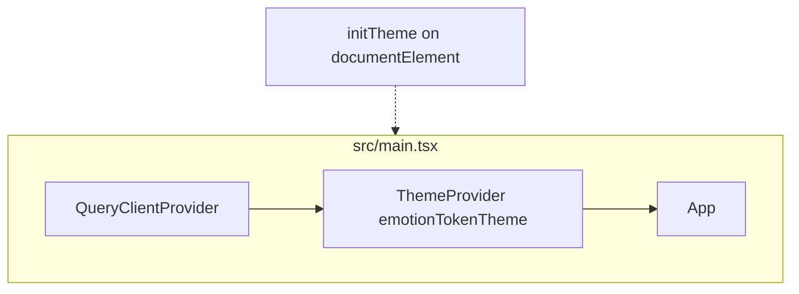
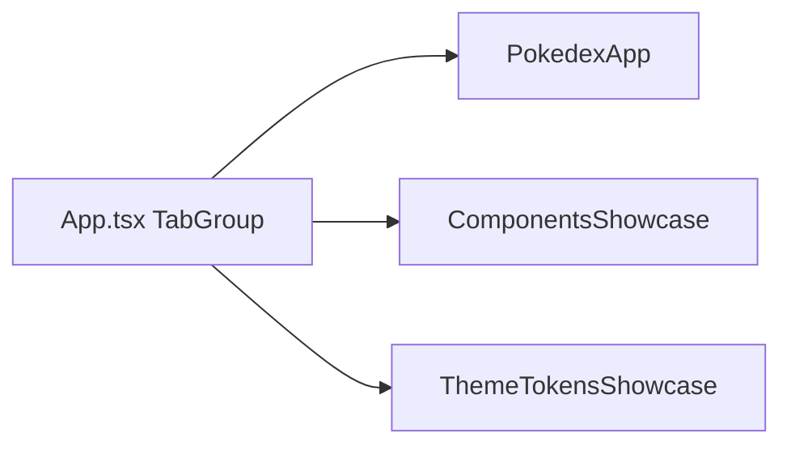
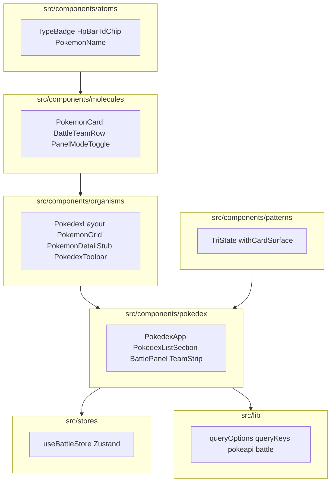
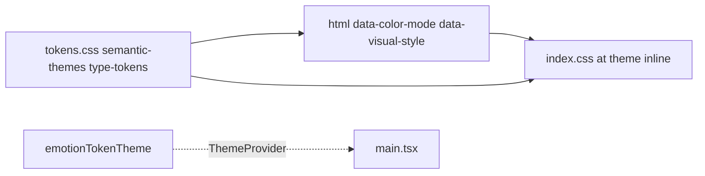
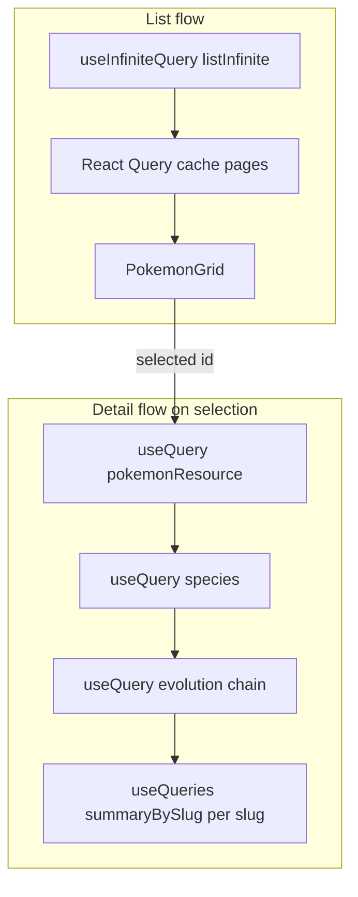
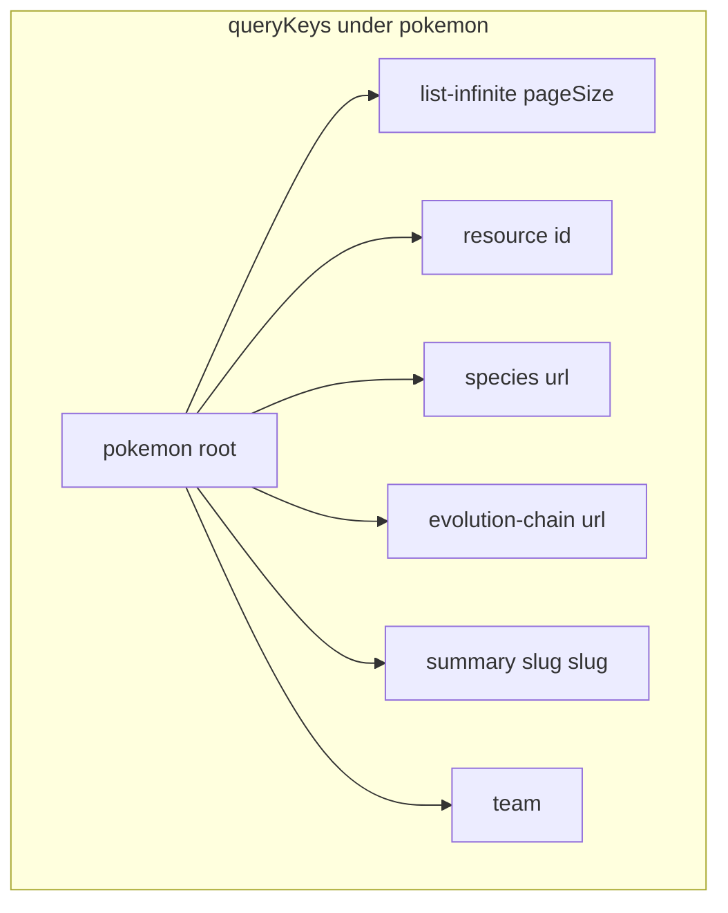
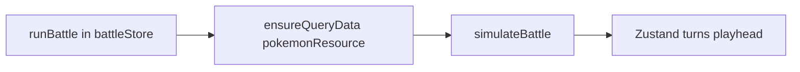

# Day 9 — Pokédex lab (React Query, composition, Storybook)

A training app against the public [PokéAPI](https://pokeapi.co/): an **infinite-scrolling list**, **dependent/parallel queries** for details and evolution data, an **optimistic “save party” mutation** with rollback, **cache teaching controls**, a **Zustand** battle simulator with timeline scrubbing, and **Storybook** coverage for UI building blocks.

This README maps **pre-onboarding UI topics** (atomic design through Storybook) and **advanced React Query topics** to **exact files** in this repo, with diagrams you can keep in sync when the code changes.

## Scripts

| Command | Purpose |
| --- | --- |
| `npm run dev` | Vite dev server |
| `npm run build` | `tsc -b` + production bundle |
| `npm run lint` | ESLint |
| `npm run storybook` | Storybook dev (port 6006) |
| `npm run build-storybook` | Static Storybook in `storybook-static/` |

---

## 1. Entry and provider stack

| Layer | File | Role |
| --- | --- | --- |
| Global providers | `src/main.tsx` | `QueryClientProvider` ([`queryClient.ts`](src/lib/queryClient.ts)), Emotion `ThemeProvider` with [`src/theme/emotionTokenTheme.ts`](src/theme/emotionTokenTheme.ts) |
| First paint / theme | `src/lib/initTheme.ts` | Reads saved prefs and sets `data-color-mode` / `data-visual-style` on `<html>` before render |
| App shell | `src/App.tsx` | Headless UI **controlled** `TabGroup` (`selectedIndex` + `onChange` + React state) with three `Tab` / `TabPanel` sections: Pokédex, Component lab, Theme |

`ApiErrorLogProvider`, `ApiErrorBanner`, and `QueryErrorBoundary` **do exist** under `src/contexts/` and `src/components/pokedex/`, but they are **not mounted** in `main.tsx` today. Treat them as optional extensions, not as active global wiring.

---

## 2. App shell: three tabs (Headless UI)

`App` lazy-loads each panel. Tab styling uses shared helpers in [`src/lib/headlessTabClass.ts`](src/lib/headlessTabClass.ts) (`headlessTabListClassFlush`, `headlessTabClass` for selected/focus states).

| Tab | Lazy module | What it’s for |
| --- | --- | --- |
| Pokédex | [`PokedexApp`](src/components/pokedex/PokedexApp.tsx) | List + details + battle mode, React Query + Zustand |
| Component lab | [`ComponentsShowcase`](src/components/showcase/ComponentsShowcase.tsx) | Narrates HOC, composition, and related patterns |
| Theme | [`ThemeTokensShowcase`](src/components/showcase/ThemeTokensShowcase.tsx) | Design tokens and theme controls (`ThemeControls`) |

---

## 3. Atomic design: where things live

This project follows a **practical** atomic layout: small pieces in `atoms/`, composed in `molecules/`, screens/sections in `organisms/`, and **feature** folders (e.g. `pokedex/`) for app wiring. Nothing stops you from promoting/demoting a component as the design evolves.

| Layer | Directory | Examples (non-exhaustive) |
| --- | --- | --- |
| Atoms | [`src/components/atoms/`](src/components/atoms/) | `TypeBadge`, `IdChip`, `PokemonName`, `HpBar`, `themeIcons` |
| Molecules | [`src/components/molecules/`](src/components/molecules/) | `PokemonCard`, `TokenThemedCallout`, `BattleTeamRow`, `BattleTurnLine`, `PanelModeToggle`, `BattlePlaybackControls` |
| Organisms | [`src/components/organisms/`](src/components/organisms/) | `PokedexLayout`, `PokemonGrid`, `PokemonDetailStub`, `PokedexToolbar`, `PokedexPanel`, `ThemeControls` |
| Feature composition | [`src/components/pokedex/`](src/components/pokedex/) | `PokedexApp`, `PokedexListSection`, `BattlePanel`, `TeamStrip`, `PokedexCacheControls` |
| Reusable patterns | [`src/components/patterns/`](src/components/patterns/) | `TriState` (function-as-children), `withCardSurface` (HOC) |
| Showcases | [`src/components/showcase/`](src/components/showcase/) | Pedagogical copy + demos |

---

## 4. Compound components (Headless UI)

**Headless UI** ships **compound** primitives: `Tab` + `TabList` + `TabGroup` share internal state; `Disclosure` + `DisclosureButton` + `DisclosurePanel` do the same. You compose markup and pass styling via props (including render-aware `className` in v2), rather than reimplementing `React.Children` walking.

| Area | File | Primitives used |
| --- | --- | --- |
| App navigation | `src/App.tsx` | `TabGroup`, `TabList`, `Tab`, `TabPanels`, `TabPanel` |
| Detail & records | `src/components/organisms/PokemonDetailStub.tsx` | Same tab primitives; `Disclosure` / `DisclosureButton` / `DisclosurePanel` for collapsible “records” |
| Filter toolbar | `src/components/organisms/PokedexToolbar.tsx` | `Listbox` (+ options), `Fieldset`, `Input`, `Label`, `Button`, `Checkbox` from `@headlessui/react` v2 API |

`headlessTabClass` in [`headlessTabClass.ts`](src/lib/headlessTabClass.ts) centralizes class names for **selected** and **focus** (keyboard) states used by `Tab` in the app header.

---

## 5. Render props vs HOCs (where this repo uses them)

| Pattern | Location | When to use (here) |
| --- | --- | --- |
| **Function-as-children / render prop** | [`TriState`](src/components/patterns/TriState.tsx) in [`PokedexListSection`](src/components/pokedex/PokedexListSection.tsx) | Exhaustive UI for `loading` \| `error` \| `ready` without prop drilling. |
| **HOC** | [`withCardSurface`](src/components/patterns/withCardSurface.tsx) | Shared “card” chrome via merged `className` on a base component. Used by [`PokedexPanel`](src/components/organisms/PokedexPanel.tsx), [`ListFetchError` / `DetailSelectPrompt`](src/components/pokedex/pokedexShells.tsx), and documented in `ComponentsShowcase` + `withCardSurface.stories.tsx`. |

---

## 6. Design tokens and theming

| Concern | Where |
| --- | --- |
| Raw tokens & semantic files | `src/styles/tokens.css`, `src/styles/semantic-themes.css`, `src/styles/type-tokens.css` (imported from [`index.css`](src/index.css)) |
| Tailwind v4 theme bridge | `index.css` `@theme inline` maps `--fg`, `--bg`, `--card-bg`, etc. to `color-*` and design utilities |
| Before paint | [`initTheme`](src/lib/initTheme.ts) + [`themeStorage`](src/lib/themeStorage.ts) |
| Emotion consumers | `emotionTokenTheme` object mirrors CSS variables (see `main.tsx` + showcase components) |

---

## 7. Storybook and isolated review

- **Config**: [`.storybook/`](.storybook/) (preview + `main.ts`).
- **Global decorators** (Query + Emotion + theme): [`src/storybook/decorators.tsx`](src/storybook/decorators.tsx) (`StoryQueryProvider`, `ThemeProvider`, `DocumentThemeSync`).

**Story files** (under `src/`, `*.stories.tsx`):

- Atoms: `IdChip`, `PokemonName`, `TypeBadge`, `HpBar`
- Molecules: `PokemonCard`, `TokenThemedCallout`, `BattleTeamRow`, `BattleTurnLine`, `PanelModeToggle`, `BattlePlaybackControls`
- Organisms: `PokedexLayout`, `PokedexPanel`, `PokedexToolbar`, `PokemonGrid`, `PokemonDetailStub`, `ThemeControls`
- Pokedex: `PokedexApp`, `BattlePanel`, `TeamStrip`, `PokedexCacheControls`, `ListFetchError`, `DetailSelectPrompt`
- Patterns: `TriState`, `withCardSurface`
- Showcase: `ComponentsShowcase`

**Component testing in isolation:** this package does **not** ship colocated `*.test.tsx` / Vitest component tests. Isolation is primarily **Storybook** plus manual runs of `PokedexApp`. Add a test runner if you need automated regression tests.

---

## 8. Advanced React Query (data layer)

### 8.1 Infinite list + pagination

| Piece | File |
| --- | --- |
| Hook | [`usePokedexInfiniteList.ts`](src/hooks/usePokedexInfiniteList.ts) (`useInfiniteQuery`) |
| Options | [`pokedexListInfinite`](src/lib/queryOptions.ts) + [`queryKeys.listInfinite`](src/lib/queryKeys.ts) |
| UI | [`PokemonGrid`](src/components/organisms/PokemonGrid.tsx) + “Load more” in [`PokedexListSection`](src/components/pokedex/PokedexListSection.tsx) |

### 8.2 Dependent and parallel queries (details)

[`usePokemonDetailsQueries.ts`](src/hooks/usePokemonDetailsQueries.ts):

- **Dependent chain:** `pokemonResourceQuery(id)` → `speciesByUrlQuery` (enabled from resource) → `evolutionChainByUrlQuery` (enabled from species).
- **Parallel:** `useQueries` over evolution slugs with `pokemonSummaryBySlugQuery` when the chain is known.

### 8.3 Optimistic updates + rollback

| Piece | File |
| --- | --- |
| Mutation | [`useTeamToggle.ts`](src/hooks/useTeamToggle.ts) — `onMutate` snapshot, `onError` rollback, `onSettled` persist |
| Source of truth (persisted) | [`teamStorage.ts`](src/lib/teamStorage.ts) |
| Key | [`queryKeys.team`](src/lib/queryKeys.ts) + [`teamRosterQuery`](src/lib/queryOptions.ts) |

### 8.4 Prefetching and background refetch

- **Prefetch on hover** — wired from list to `queryClient.prefetchQuery` in [`PokedexListSection`](src/components/pokedex/PokedexListSection.tsx) (and card props in `PokemonGrid`).
- **List live refresh (demo)** — `refetchInterval` when `listLive` is on in `usePokedexInfiniteList`.

### 8.5 Cache management (learning UI)

[`PokedexCacheControls.tsx`](src/components/pokedex/PokedexCacheControls.tsx) demonstrates `invalidateQueries`, `resetQueries`, and marking details stale with `refetchType: 'none'`.

### 8.6 Type-safe query options

- Central factories: [`queryOptions.ts`](src/lib/queryOptions.ts), stable keys: [`queryKeys.ts`](src/lib/queryKeys.ts).

### 8.7 Battle flow: `ensureQueryData` + Zustand (not server cache in the store)

| Step | What runs |
| --- | --- |
| Run | [`battleStore.runBattle`](src/stores/battleStore.ts) fetches every party member via `queryClient.ensureQueryData(pokemonResourceQuery(id))` |
| Simulate | [`simulateBattle`](src/lib/battle/simulateBattle.ts) (pure, deterministic seed) |
| UI state | Zustand: parties, `turns`, `playhead`, `maxHpA` / `maxHpB` — separate from **TanStack** cache semantics |

### 8.8 Errors in the product path

- **List errors:** [`TriState`](src/components/patterns/TriState.tsx) branches + [`ListFetchError`](src/components/pokedex/pokedexShells.tsx) + copy from [`userFacingErrors.ts`](src/lib/userFacingErrors.ts) with a **Try again** that calls `refetch()`.
- **Class boundary (optional, unused at root):** [`QueryErrorBoundary`](src/components/pokedex/QueryErrorBoundary.tsx) is available but **not** wrapped in `App` / `PokedexApp` by default.
- **Global log + banner (optional, unused at root):** [`ApiErrorLogProvider`](src/contexts/ApiErrorLogContext.tsx) and [`ApiErrorBanner`](src/components/pokedex/ApiErrorBanner.tsx) are not mounted in `main.tsx`; they require explicit wiring.

---

## 9. Curriculum map (pre-onboarding + advanced RQ)

Use this as a **checklist** against the code you actually ship.

| Topic | Practiced in this repo |
| --- | --- |
| Atomic design / folder tiers | `atoms/`, `molecules/`, `organisms/`, `pokedex/`, `patterns/` (see [§3](#sec-3-atomic)) |
| Compound components (library) | Headless UI `Tab*`, `Disclosure*`, `Listbox` (see [§4](#sec-4-compound)) |
| Headless + styling | `headlessTabClass`, `PokedexToolbar` + Tailwind (see [§4](#sec-4-compound)) |
| Render props | `TriState` (see [§5](#sec-5-render-hoc)) |
| HOCs | `withCardSurface` (see [§5](#sec-5-render-hoc)) |
| Composition | `PokedexApp` + `PokedexLayout` + `BattlePanel`, etc. |
| Design tokens & theming | `styles/*.css`, `index.css` `@theme`, `initTheme`, `emotionTokenTheme` (see [§6](#sec-6-tokens)) |
| CSS-in-JS with tokens | Emotion `ThemeProvider` + `emotionTokenTheme` (components using `@emotion` can read the same variables) (see [§6](#sec-6-tokens)) |
| Storybook documentation | `*.stories.tsx` list in [§7](#sec-7-storybook) |
| Isolated review | Storybook; **no** checked-in `*.test.tsx` for components here (see [§7](#sec-7-storybook)) |
| Infinite queries | `usePokedexInfiniteList` (see [§8.1](#sec-8-1-infinite)) |
| Dependent + parallel | `usePokemonDetailsQueries` (see [§8.2](#sec-8-2-dependent)) |
| Optimistic + rollback | `useTeamToggle` (see [§8.3](#sec-8-3-optimistic)) |
| Cache invalidation / strategies | `PokedexCacheControls` (see [§8.5](#sec-8-5-cache)) |
| Type-safe query layer | `queryOptions` + `queryKeys` (see [§8.6](#sec-8-6-options)) |
| Prefetch / background | Prefetch in list, optional `refetchInterval` (see [§8.4](#sec-8-4-prefetch)) |
| “Global” error handling | Inline + optional modules **not** wired at root (see [§8.8](#sec-8-8-errors)) |

---

## 10. Related paths (quick index)

| Area | Path |
| --- | --- |
| API fetchers + DTOs | `src/lib/pokeapi/` |
| Query client defaults | `src/lib/queryClient.ts` |
| Battle sim (pure) | `src/lib/battle/simulateBattle.ts` |
| Zustand battle store | `src/stores/battleStore.ts` |
| User-facing error copy | `src/lib/userFacingErrors.ts` |

When you add features, **update the diagrams** in this README if folder structure or data flow changes—readers will treat it as a map.
