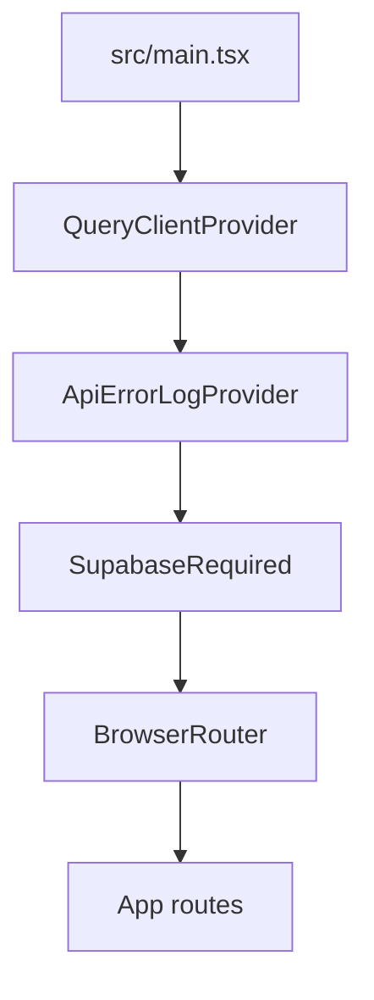

# Day 10 — Task management (TanStack Query + Supabase)

A small **tasks** app: **infinite list**, **task detail** with **dependent comments**, **parallel** header queries, **optimistic PATCH** with rollback, **cache lab** controls, **global** API error banner, and a **query error boundary** around the detail panel. All data comes from **Postgres via Supabase**. If env vars are missing, [`SupabaseRequired`](src/components/SupabaseRequired.tsx) shows setup instructions instead of the app.

## Stack

| Piece | Role |
| --- | --- |
| React 19 + Vite | UI and dev server |
| TanStack Query v5 | Server state, cache, mutations |
| Zod | Response shape at the API boundary |
| Supabase JS | Typed Postgres access |

## Quick start

```bash
cd "Day 10"
npm install
```

1. Create a Supabase project and copy **Project URL** and **anon public** key.
2. In the SQL editor, run [`supabase/migrations/001_rq10.sql`](supabase/migrations/001_rq10.sql) (creates `rq10_*` tables, seed data, and dev RLS scoped to the demo workspace).
3. Copy [`.env.example`](.env.example) to `.env` and set `VITE_SUPABASE_URL` and `VITE_SUPABASE_ANON_KEY` (optionally `VITE_RQ10_WORKSPACE_ID`).
4. `npm run dev`

The migration uses the same **demo RLS** idea as Day 8: anon/authenticated can only touch rows for the fixed workspace id. Tighten policies before any production use.

## Learn + demo (TanStack Query topics)

The app is organized as a small **learning hub** with one page per RQ concept. The **full task demo** (header, new task, infinite list, detail, cache panel, error banner) is the same on every topic; only the narrative and a **focus ring** on the relevant region change.

| URL | Topic |
| --- | --- |
| `/` | Redirects to `/learn` |
| `/learn` | Card grid: links to each topic (opens at `…/tasks`) |
| `/learn/:slug/tasks` | Topic narrative + live demo, task list |
| `/learn/:slug/tasks/:taskId` | Same, with a task open |

| Slug | What it highlights |
| --- | --- |
| `parallel-queries` | Header (parallel `useQueries`) |
| `infinite-list` | Task list (`useInfiniteQuery`) |
| `dependent-queries` | Detail + comments (dependent fetch) |
| `optimistic-mutations` | Cycle status row (optimistic mutation) |
| `prefetching` | List rows (hover prefetch) |
| `cache-invalidation` | Cache & debug panel |
| `global-errors` | Top error banner |
| `error-boundaries` | Detail panel (query error boundary) |
| `background-refetch` | Stats chips in the header |

Copy and topic metadata live in [`src/data/learnTopics.ts`](src/data/learnTopics.ts).

## npm scripts

| Command | What it does |
| --- | --- |
| `npm run dev` | Vite dev server (requires configured Supabase; see above) |
| `npm run build` | `tsc` + production bundle |
| `npm run lint` | ESLint |
| `npm test` / `npm run test:watch` | Vitest |

## Concept map (where to look in code)

| Topic | Location |
| --- | --- |
| Supabase required gate | [`src/components/SupabaseRequired.tsx`](src/components/SupabaseRequired.tsx) |
| Parallel queries (`useQueries`) | [`src/components/WorkspaceHeader.tsx`](src/components/WorkspaceHeader.tsx) |
| Infinite list (`useInfiniteQuery`) | [`src/features/tasks/TaskListInfinite.tsx`](src/features/tasks/TaskListInfinite.tsx) + [`src/lib/queryOptions.ts`](src/lib/queryOptions.ts) |
| Dependent query (comments `enabled` after task succeeds) | [`src/features/tasks/TaskDetailBoundary.tsx`](src/features/tasks/TaskDetailBoundary.tsx) |
| Optimistic update + rollback | [`src/features/tasks/usePatchTask.ts`](src/features/tasks/usePatchTask.ts) |
| Prefetch on hover | [`src/features/tasks/TaskListInfinite.tsx`](src/features/tasks/TaskListInfinite.tsx) (`prefetchQuery`) |
| Query key factories + workspace scope | [`src/lib/queryKeys.ts`](src/lib/queryKeys.ts) |
| Supabase data access (typed) | [`src/api/supabase/rq10Api.ts`](src/api/supabase/rq10Api.ts) |
| Unified API entry | [`src/api/unified.ts`](src/api/unified.ts) |
| Global mutation/query errors | [`src/lib/queryClient.ts`](src/lib/queryClient.ts) + [`src/lib/errorBus.ts`](src/lib/errorBus.ts) + [`src/components/GlobalErrorBanner.tsx`](src/components/GlobalErrorBanner.tsx) |
| Error boundary (detail) | [`src/components/QueryErrorBoundary.tsx`](src/components/QueryErrorBoundary.tsx) + `throwOnError` in detail query |
| Cache tools / custom invalidation | [`src/components/CacheToolsPanel.tsx`](src/components/CacheToolsPanel.tsx) |
| Simulated write failure | [`src/lib/simulateWriteFailure.ts`](src/lib/simulateWriteFailure.ts) + Cache panel toggle |

## Provider stack



## Self-check

1. **Optimistic path:** Open a task, click **Cycle status (optimistic)** — the status changes immediately; if **Fail writes while enabled** is on in Cache & debug, each write fails until you turn it off: the UI rolls back and the global banner shows the error.
2. **Comments:** Comments load only after the task query succeeds (dependent query).
3. **Parallel strip:** The header should show user, workspace name, and rolling stats (background refetch on an interval).
4. **Cache lab:** Use **Invalidate tasks prefix** vs **Predicate for workspace id** and watch entries in React Query Devtools.

## Security note

`001_rq10.sql` is for **local training** only. Replace broad policies with `auth.uid()`-based rules before shipping anything public.
