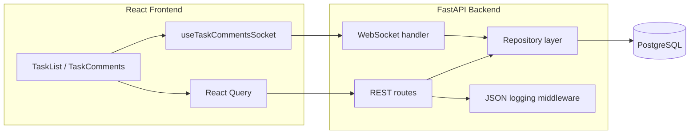

# Day 15: Full-Stack Task App

A production-oriented learning project: FastAPI backend with PostgreSQL, JWT auth, REST CRUD, real-time comments over WebSockets, structured JSON logging, Docker Compose for local dev, GitHub Actions CI, and Railway deployment.

## Overview

Users log in with demo credentials, manage tasks (create, edit, complete, delete), and discuss tasks via comments. Comments sync live across browser tabs through WebSockets. Task and comment data persist in PostgreSQL. Auth uses short-lived JWT access tokens and in-memory refresh tokens.



## Tech stack

| Layer | Choices |
|-------|---------|
| Backend | FastAPI, SQLAlchemy (sync + psycopg), Alembic, python-jose |
| Frontend | React 19, Vite, React Query, React Compiler |
| Database | PostgreSQL 16 |
| Auth | JWT access tokens + in-memory refresh tokens |
| Real-time | FastAPI WebSockets, per-task connection manager |
| Logging | stdlib `logging` with JSON formatter and request middleware |
| Local ops | Docker Compose (Postgres + backend + frontend) |
| CI | GitHub Actions (pytest + Postgres, frontend lint + build) |
| Deploy | Railway (three services: Postgres, backend, frontend) |

## Project structure

```
Day 15/
├── main.py                 # FastAPI app, routes, middleware, lifespan
├── config.py               # Env-driven settings (single source of truth)
├── database.py             # SQLAlchemy engine, SessionLocal, get_db
├── orm_models.py           # TaskModel, CommentModel (SQLAlchemy ORM)
├── repositories.py         # ABC + SqlAlchemy* repository implementations
├── auth.py                 # JWT + in-memory refresh token store
├── comment_ws.py           # WebSocket message builders and handlers
├── connection_manager.py   # Per-task WebSocket registry and broadcast
├── logging_config.py       # JSON formatter, request logging middleware
├── tracing.py              # Request/trace ID context and header propagation
├── models/
│   ├── tasks.py            # Pydantic Task / TaskCreate / TaskUpdate
│   └── comments.py         # Pydantic Comment / CommentCreate / CommentUpdate
├── alembic/                # Schema migrations
├── tests/                  # pytest suite (49 tests)
├── health.py               # Liveness/readiness health checks
├── sentry_config.py        # Optional Sentry integration
├── elastic_apm_config.py   # Optional Elastic APM integration
├── alerting.py             # Critical error reporting hooks
├── docs/                   # Capstone audits, runbook, architecture (see below)
├── loadtest/               # k6 load test script
├── docker-compose.yml
├── Dockerfile              # Backend image
├── docker-entrypoint.sh    # alembic upgrade head, then uvicorn
├── frontend/               # React SPA (see frontend/README.md for Vite defaults)
├── DEPLOYMENT.md           # Railway pitfalls and deploy checklist
└── .env.example            # Documented environment variables
```

Pydantic schemas in `models/` are kept separate from SQLAlchemy models in `orm_models.py`. Routes depend on repository abstractions, not on the database session directly.

## Backend implementation

### Configuration (`config.py`)

All environment-driven behavior is centralized here. Other modules import from `config.py` instead of reading `os.environ` directly.

- `get_database_url()` reads `DATABASE_URL` and normalizes schemes (`postgres://` and bare `postgresql://` become `postgresql+psycopg://` for the sync psycopg driver).
- `get_cors_origins()` parses comma-separated `CORS_ORIGINS`.
- JWT settings: `JWT_SECRET`, `JWT_ALGORITHM`, `ACCESS_TOKEN_EXPIRE_MINUTES`, `REFRESH_TOKEN_EXPIRE_DAYS`.
- Demo login: `DEMO_USER_EMAIL`, `DEMO_USER_PASSWORD`.
- Server: `PORT`.
- Logging: `LOG_LEVEL` (default `INFO`), `LOG_FORMAT` (`json` or `text`).

Local values load from `.env` via `python-dotenv`.

### Database layer (`database.py`, `orm_models.py`)

- Sync SQLAlchemy engine and `sessionmaker` bound to `get_database_url()`.
- `get_db()` is a FastAPI dependency that yields a session per request and closes it in a `finally` block.

**Schema (`orm_models.py`)**

| Table | Columns | Notes |
|-------|---------|-------|
| `tasks` | `id`, `title`, `description`, `completed` | Primary key on `id` |
| `comments` | `id`, `task_id`, `body`, `author_email`, `created_at` | FK to `tasks.id` with `ON DELETE CASCADE` |

`TaskModel.comments` uses `cascade="all, delete-orphan"`, so deleting a task removes its comments in the ORM and database.

The initial Alembic migration (`a1b2c3d4e5f6`) creates both tables and seeds task id `1` ("Task 1") for local dev and tests.

### Repository pattern (`repositories.py`)

Abstract `TaskRepository` and `CommentRepository` define the persistence contract. `SqlAlchemyTaskRepository` and `SqlAlchemyCommentRepository` implement it with a injected `Session`.

Design choices:

- ORM rows map to Pydantic `Task` / `Comment` via `_to_task()` and `_to_comment()`.
- Commits roll back on `SQLAlchemyError`.
- Comment body validation: non-empty after strip, max 1000 characters.
- Comment update/delete require `author_email` to match the stored author (`PermissionError` if not).

FastAPI dependencies `get_task_repository` and `get_comment_repository` construct the SQLAlchemy implementations from `get_db()`.

### Authentication (`auth.py`)

| Mechanism | Storage | Lifetime |
|-----------|---------|----------|
| Access token | JWT (`sub` = email) | `ACCESS_TOKEN_EXPIRE_MINUTES` (default 30) |
| Refresh token | In-memory dict in `auth.py` | `REFRESH_TOKEN_EXPIRE_DAYS` (default 7) |

Endpoints:

- `POST /token` validates demo credentials, returns access + refresh tokens.
- `POST /token/refresh` issues a new access token from a valid refresh token.
- `POST /logout` revokes a refresh token.

Protected REST routes use `Depends(get_current_user)` with `OAuth2PasswordBearer`. WebSockets pass the JWT as a `token` query parameter and validate via `get_user_from_token()`.

**Known limitation:** refresh tokens live in process memory. Restarts and redeploys log users out. Acceptable for this demo; production would persist refresh tokens in PostgreSQL.

### REST API (`main.py`)

| Method | Path | Auth | Description |
|--------|------|------|-------------|
| `GET` | `/` | No | Health-style greeting |
| `GET` | `/live` | No | Liveness probe |
| `GET` | `/ready` | No | Readiness probe (DB check) |
| `GET` | `/health` | No | Full health check (same as ready) |
| `GET` | `/me` | Yes | Current user email |
| `GET` | `/tasks` | Yes | List all tasks |
| `POST` | `/tasks` | Yes | Create task |
| `GET` | `/tasks/{id}` | Yes | Get one task |
| `PATCH` | `/tasks/{id}` | Yes | Partial update |
| `DELETE` | `/tasks/{id}` | Yes | Delete task (cascades comments) |
| `POST` | `/token` | No | Login |
| `POST` | `/token/refresh` | No | Refresh access token |
| `POST` | `/logout` | No | Revoke refresh token |
| `GET` | `/tasks/{id}/comments` | Yes | List comments for task |
| `POST` | `/tasks/{id}/comments` | Yes | Create comment + broadcast |
| `PATCH` | `/tasks/{id}/comments/{cid}` | Yes | Update own comment + broadcast |
| `DELETE` | `/tasks/{id}/comments/{cid}` | Yes | Delete own comment + broadcast |

Comment create/update/delete routes are `async` so they can `await manager.broadcast()` after persistence.

### WebSockets

**`GET /ws/echo`** (demo): echoes text messages.

**`WS /ws/tasks/{task_id}?token=...`** (production path for comments):

1. Accept connection.
2. Reject with code `1008` if task missing or token invalid.
3. Register socket in `ConnectionManager` for that `task_id`.
4. Send `comments.snapshot` with all existing comments.
5. Handle incoming JSON; only `comment.create` is supported over the socket.
6. On disconnect, unregister and log.

**Outbound message types**

| `type` | Payload |
|--------|---------|
| `comments.snapshot` | `comments: Comment[]` |
| `comment.created` | `comment: Comment` |
| `comment.updated` | `comment: Comment` |
| `comment.deleted` | `comment_id`, `task_id` |
| `error` | `message` |

REST comment mutations also broadcast the same shapes so clients stay in sync whether they posted via HTTP or WebSocket.

`ConnectionManager` keeps `dict[task_id, set[WebSocket]]`. `broadcast()` sends to all connections for a task and drops dead sockets on send failure.

### Structured JSON logging (`logging_config.py`)

Configured at import via `setup_logging()` in `main.py`. Output is one JSON object per line on stdout, which log aggregators (Railway logs, Datadog, CloudWatch, ELK) can index by field.

#### Log levels

| Source | Level | When |
|--------|-------|------|
| `LOG_LEVEL` | Root + uvicorn | Default `INFO`; set `DEBUG` to also emit `http.request.received` |
| HTTP 2xx/3xx | `INFO` | Successful responses |
| HTTP 4xx | `WARNING` | Client errors (e.g. 401, 404) |
| HTTP 5xx / unhandled exception | `ERROR` | Server errors |
| Slow requests | `WARNING` | Duration exceeds `LOG_SLOW_REQUEST_MS` (default 1000 ms; set `0` to disable) |

Each JSON line includes a numeric `severity` field (syslog-style: INFO=6, WARNING=4, ERROR=3) for aggregator level mapping.

#### Log aggregation fields

Every log line carries stable index keys:

- `service` from `LOG_SERVICE` (default `day15-api`)
- `environment` from `LOG_ENVIRONMENT` (default `development`)
- `request_id` propagated from `X-Request-ID` or generated per request
- `trace_id` propagated from `X-Trace-ID` for cross-service correlation (browser tab session)
- `event` for filtering (`http.response`, `auth.login_failed`, `ws.connect`, etc.)

#### Request ID tracing across services

`tracing.py` centralizes trace context in `ContextVar`s so every log line within a request shares the same IDs.

| ID | Header / param | Scope | Set by |
|----|----------------|-------|--------|
| `trace_id` | `X-Trace-ID` | Browser tab session | Frontend (`sessionStorage`, reused across calls) |
| `request_id` | `X-Request-ID` | Single HTTP call or WebSocket connection | Frontend (new UUID per request) |

**Frontend** (`frontend/src/lib/requestTracing.js`):

- `getTraceId()` stores a tab-level ID in `sessionStorage`.
- `createRequestId()` generates a fresh UUID per API call.
- `tracingHeaders()` adds both headers to every `fetch` (`apiClient.js`, `auth.js`).
- `tracingQueryParams()` adds `trace_id` and `request_id` to WebSocket URLs (browsers cannot set custom WS headers).

**Backend**:

- HTTP middleware reads incoming headers, binds context for the request, echoes both IDs on the response.
- WebSocket handler reads `trace_id` / `request_id` from query params or connection headers, binds context for the connection lifetime.
- Invalid IDs are replaced with generated UUIDs (max 128 chars, alphanumeric plus `._:-`).

In Railway or Datadog, filter frontend and backend logs with the same `trace_id` to follow a user action end to end.

Sensitive data is never logged: `Authorization` and `Cookie` headers are omitted; query params `token`, `password`, and `refresh_token` are redacted to `[REDACTED]`. Request and response bodies are not logged, only `Content-Length` and `Content-Type` metadata.

#### FastAPI request/response logging

`RequestLoggingMiddleware` is pure ASGI (HTTP only; WebSocket upgrades are unaffected):

1. **`http.request.received`** (`DEBUG`): method, path, sanitized query string, client IP, user agent, request content metadata.
2. **`http.response`** (`INFO` / `WARNING` / `ERROR`): same request fields plus status code, duration, response content length and type.

Uvicorn access logs are disabled (`--no-access-log`) to avoid duplicate unstructured lines. Application lifespan logs `app.startup` / `app.shutdown`. Failed logins log `auth.login_failed` with email only. WebSocket connect/disconnect log `ws.connect` / `ws.disconnect`.

Set `LOG_FORMAT=text` for human-readable local output.

Example response log line:

```json
{"timestamp": "2026-06-11T12:00:00.123456+00:00", "level": "INFO", "severity": 6, "service": "day15-api", "environment": "production", "logger": "day15.http", "message": "request completed", "request_id": "...", "event": "http.response", "http_method": "GET", "path": "/tasks", "status_code": 200, "duration_ms": 4.12, "client_ip": "127.0.0.1", "user_agent": "...", "response_content_length": 128, "response_content_type": "application/json"}
```

### Startup (`docker-entrypoint.sh`)

1. `alembic upgrade head` (self-migrating deploys).
2. `uvicorn main:app --host 0.0.0.0 --port "${PORT:-8000}" --no-access-log`.

Docker Compose overrides the command for local dev to add `--reload`.

## Frontend implementation

### API base URL (`frontend/src/lib/apiBase.js`)

- `VITE_API_BASE_URL` (optional): absolute API origin for split deploys.
- Empty base URL in local dev: requests are same-origin and proxied by Vite.

### HTTP client (`frontend/src/lib/apiClient.js`)

- Attaches `Authorization: Bearer` from `tokenStorage`.
- On `401`, attempts a single shared refresh via `POST /token/refresh`, then retries once.
- Clears tokens and throws `UnauthorizedError` if refresh fails.

### WebSocket hook (`frontend/src/hooks/useTaskCommentsSocket.js`)

Resolves WebSocket URL in order:

1. `VITE_API_WS_HOST` (e.g. `wss://api.example.com`)
2. `VITE_API_BASE_URL` with `http` replaced by `ws`
3. Page origin (`wss:` when page is HTTPS)

Features:

- Exponential backoff reconnect (cap 30s).
- Handles snapshot, create, update, delete, and error messages.
- Closes with code `1008` triggers auth error callback (invalid token).
- React Strict Mode safe: avoids closing sockets still in `CONNECTING` state (prevents Vite proxy EPIPE).

### Vite dev proxy (`frontend/vite.config.js`)

Proxies `/token`, `/token/refresh`, `/logout`, `/me`, `/tasks`, and `/ws` to `API_PROXY_TARGET` (default `http://127.0.0.1:8000`, overridden in Compose to `http://backend:8000`).

### UI (`frontend/src/App.jsx`)

- Login form, user profile, task list with inline comments panel.
- React Query for `/me` and tasks; comments cache helpers in `lib/commentsCache.js`.
- `TaskComments` opens a WebSocket per expanded task and merges live events into the UI.

### Frontend Docker image (`frontend/Dockerfile`)

Multi-stage:

1. **`build`**: `npm ci`, `npm run build` with `VITE_*` build args inlined at compile time.
2. **`production`**: nginx serves `dist/` using `nginx.conf.template` (SPA `try_files`, listens on `$PORT`).

Docker Compose targets the `build` stage and runs `npm run dev` for hot reload. Railway uses the `production` stage.

## Local development

### Prerequisites

- Python 3.12+
- Node.js 22+ (for frontend)
- PostgreSQL 16 (or use Docker Compose for everything)

### Option A: Docker Compose (recommended)

```bash
cd "Day 15"
cp .env.example .env
docker compose up --build
```

| Service | URL |
|---------|-----|
| Frontend | http://localhost:5173 |
| Backend | http://localhost:8000 |
| Postgres | localhost:5432 (`akash` / `password`, db `day15_tasks`) |

Default login: `test@example.com` / `password` (from `.env.example`).

### Option B: Run services directly

**Database**

```bash
createdb day15_tasks
createdb day15_tasks_test
cd "Day 15"
cp .env.example .env
alembic upgrade head
```

**Backend**

```bash
cd "Day 15"
python -m venv .venv && source .venv/bin/activate
pip install -r requirements.txt -r requirements-dev.txt
uvicorn main:app --reload --no-access-log
```

**Frontend**

```bash
cd "Day 15/frontend"
npm ci
npm run dev
```

## Testing

49 pytest tests in `tests/`:

| File | Coverage |
|------|----------|
| `test_tasks_crud.py` | Auth gate, list seed task, create/update/delete, cascade delete comments, 404 |
| `test_comments_ws.py` | REST comments, WebSocket snapshot/create/broadcast, auth errors, update/delete broadcasts |
| `test_logging.py` | Aggregation fields, status-based levels, request/response metadata, query redaction |
| `test_tracing.py` | Header propagation, WebSocket trace context, ID validation |
| `test_health.py` | `/live`, `/ready`, `/health` endpoints |
| `test_sentry.py` | Sentry initialization and error capture hooks |
| `test_elastic_apm.py` | Elastic APM client and repository spans |
| `test_alerting.py` | Critical error alerting fields |

`conftest.py` provisions a dedicated test database (`TEST_DATABASE_URL`), runs Alembic migrate up/down per session, truncates and re-seeds task id 1 before each test, and overrides `get_db` with the test session factory.

```bash
cd "Day 15"
pip install -r requirements.txt -r requirements-dev.txt
python -m pytest -q
```

CI runs the same suite against a Postgres service (see `.github/workflows/day15-ci.yaml`).

## Deployment

See [DEPLOYMENT.md](./DEPLOYMENT.md) for the full Railway walkthrough, pitfalls, and verification checklist.

**Railway layout (three services)**

1. PostgreSQL plugin
2. Backend (`Day 15` root, backend `Dockerfile`)
3. Frontend (`Day 15/frontend` root, frontend `Dockerfile` production stage)

**Backend variables**

```
DATABASE_URL=${{Postgres.DATABASE_URL}}
JWT_SECRET=<openssl rand -hex 32>
DEMO_USER_EMAIL=test@example.com
DEMO_USER_PASSWORD=<strong-password>
CORS_ORIGINS=https://<frontend-domain>.up.railway.app
LOG_LEVEL=INFO
LOG_FORMAT=json
```

**Frontend variables (build time)**

```
VITE_API_BASE_URL=https://<backend-domain>.up.railway.app
VITE_API_WS_HOST=wss://<backend-domain>.up.railway.app
```

Use `https://` and `wss://` on deployed domains. Browsers block mixed content from HTTPS pages.

Deploy order: Postgres, backend (generate domain), frontend (set API URLs, rebuild), then set backend `CORS_ORIGINS` to the frontend URL.

## Environment variables

| Variable | Service | Default | Purpose |
|----------|---------|---------|---------|
| `DATABASE_URL` | Backend | local Postgres URL | SQLAlchemy connection string |
| `TEST_DATABASE_URL` | Tests | `day15_tasks_test` | Isolated test database |
| `PORT` | Backend / Frontend nginx | `8000` / `8080` | Listen port (Railway injects this) |
| `JWT_SECRET` | Backend | `your-secret-key` | JWT signing key |
| `JWT_ALGORITHM` | Backend | `HS256` | JWT algorithm |
| `ACCESS_TOKEN_EXPIRE_MINUTES` | Backend | `30` | Access token TTL |
| `REFRESH_TOKEN_EXPIRE_DAYS` | Backend | `7` | Refresh token TTL |
| `DEMO_USER_EMAIL` | Backend | `test@example.com` | Demo login email |
| `DEMO_USER_PASSWORD` | Backend | `password` | Demo login password |
| `CORS_ORIGINS` | Backend | localhost Vite URLs | Comma-separated allowed origins |
| `LOG_LEVEL` | Backend | `INFO` | Root log level (`DEBUG` enables request-received logs) |
| `LOG_FORMAT` | Backend | `json` | `json` or `text` |
| `LOG_SERVICE` | Backend | `day15-api` | Service name for log aggregation |
| `LOG_ENVIRONMENT` | Backend | `development` | Deployment environment label |
| `LOG_SLOW_REQUEST_MS` | Backend | `1000` | Log slow responses as `WARNING` (`0` disables) |
| `VITE_API_BASE_URL` | Frontend build | empty | API origin for split deploy |
| `VITE_API_WS_HOST` | Frontend build | empty | WebSocket origin override |
| `API_PROXY_TARGET` | Frontend dev | `http://127.0.0.1:8000` | Vite proxy target in Compose |

Copy `.env.example` to `.env` for local backend settings. Frontend local env lives in `frontend/.env` when needed.

## Design decisions and trade-offs

| Decision | Rationale |
|----------|-----------|
| Sync SQLAlchemy + psycopg | Avoids async event-loop conflicts with `TestClient` and WebSocket tests |
| Repository abstraction | Routes stay testable and swappable; ORM details stay in one module |
| In-memory refresh tokens | Simple demo auth without a `refresh_tokens` table |
| Pydantic vs ORM split | API contracts decoupled from persistence shape |
| JSON logging to stdout | Container-friendly; one line per event for log aggregators |
| Multi-stage frontend Docker | Hot reload locally, static nginx bundle in production |
| Demo single-user auth | Focus on CRUD, WebSockets, and deploy mechanics, not user management |

## Verification checklist

1. `GET /` returns `{"message": "Hello, World!"}`.
2. Login works with demo credentials.
3. Tasks persist across backend restarts (PostgreSQL).
4. Open one task in two tabs; post a comment in one tab and see it appear in the other (WebSocket + CORS + `wss://` correct).
5. Backend logs emit parseable JSON lines with `event` and `request_id` fields.
6. `python -m pytest -q` passes all 49 tests.

## Capstone documentation

Audits and operator docs from the Day 15 final review:

| Document | Purpose |
|----------|---------|
| [docs/CODE_REVIEW.md](./docs/CODE_REVIEW.md) | Comprehensive code review findings |
| [docs/SECURITY_AUDIT.md](./docs/SECURITY_AUDIT.md) | OWASP-style security audit |
| [docs/A11Y_AUDIT.md](./docs/A11Y_AUDIT.md) | WCAG accessibility audit |
| [docs/PERFORMANCE.md](./docs/PERFORMANCE.md) | k6 load testing guide |
| [docs/ARCHITECTURE.md](./docs/ARCHITECTURE.md) | Architecture diagrams (auth, WS, deploy) |
| [docs/RUNBOOK.md](./docs/RUNBOOK.md) | Deployment and incident runbook |
| [docs/DEMO_SCRIPT.md](./docs/DEMO_SCRIPT.md) | Demo presentation script |
| [docs/TRADE_OFFS.md](./docs/TRADE_OFFS.md) | Technical decisions discussion guide |
| [docs/KNOWLEDGE_TRANSFER.md](./docs/KNOWLEDGE_TRANSFER.md) | Onboarding and handoff for the team |
| [docs/NEXT_STEPS.md](./docs/NEXT_STEPS.md) | Prioritized backlog and completion checklist |

## Related docs

- [DEPLOYMENT.md](./DEPLOYMENT.md): Railway steps, mixed-content fixes, Vite build-time vars, and other pitfalls encountered during deploy.
- [docs/RUNBOOK.md](./docs/RUNBOOK.md): Operator checklist (deploy, verify, rollback, troubleshoot).
- [frontend/README.md](./frontend/README.md): Vite defaults and WebSocket sequence diagram.
