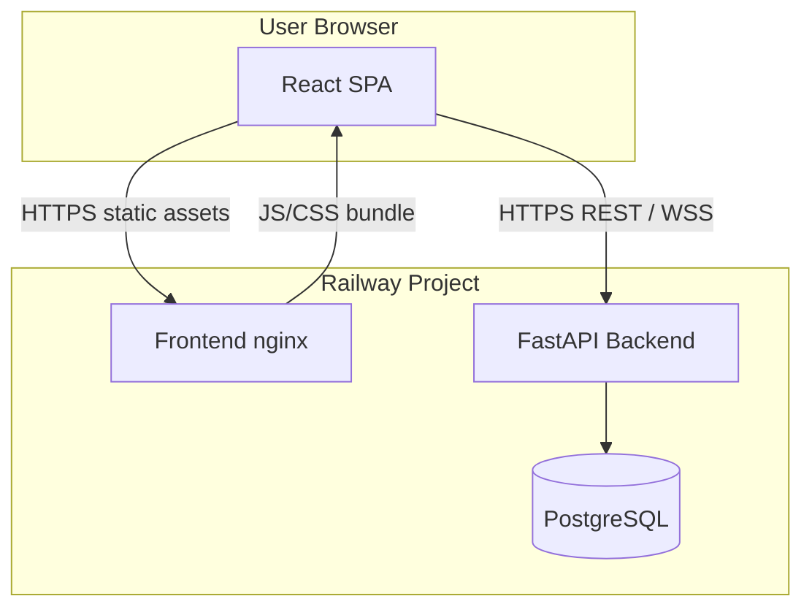
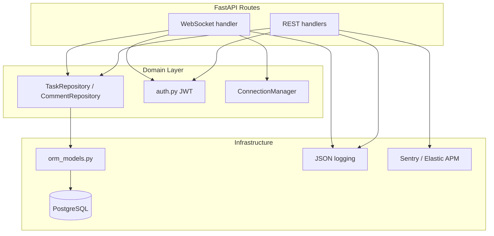
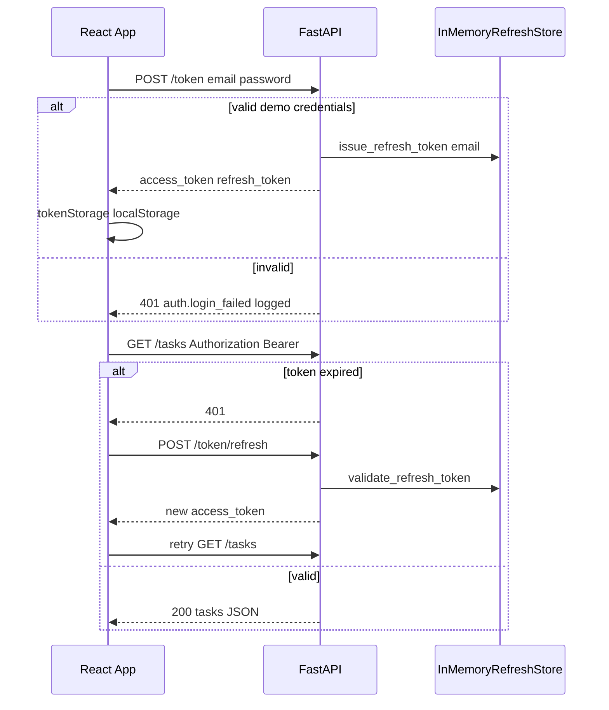
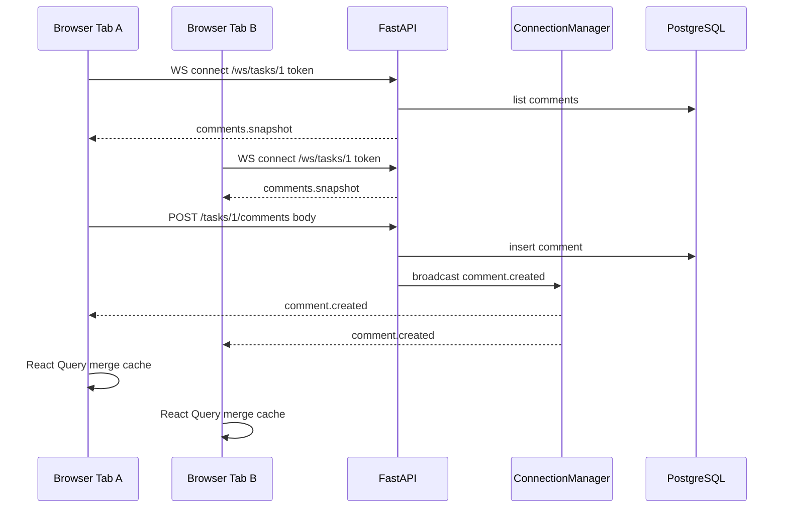
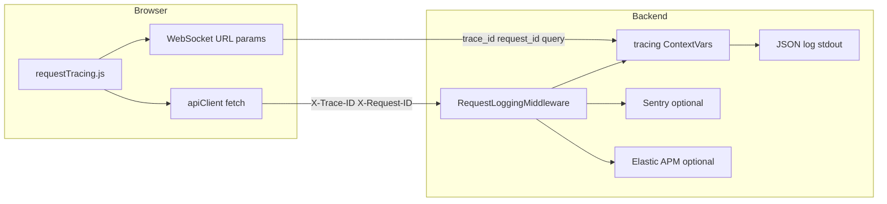
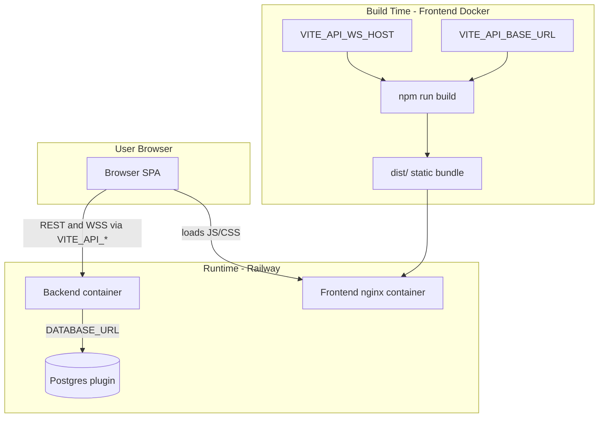
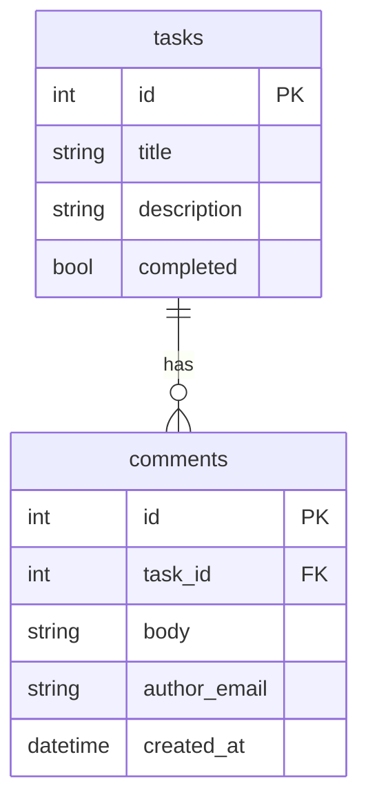

# Day 15: Architecture Reference

Deep-dive architecture for the Full-Stack Task App. For a quick overview, see the diagram in [README.md](../README.md).

---

## 1. System Context

On Railway split deploy, the browser loads static assets from the frontend nginx service and calls the backend API domain directly (`VITE_API_BASE_URL` / `VITE_API_WS_HOST`). REST and WebSocket traffic do not pass through the frontend container.

Local dev differs: with an empty `VITE_API_BASE_URL`, the Vite dev server on `:5173` proxies `/token`, `/tasks`, and `/ws` to the backend (same-origin through the frontend dev server).

| Component | Technology | Responsibility |
|-----------|------------|----------------|
| Frontend | React 19, Vite, React Query | Task UI, auth shell, WebSocket client |
| Frontend prod | nginx | Serve static `dist/`, SPA routing |
| Backend | FastAPI, sync SQLAlchemy | REST API, WebSocket hub, auth |
| Database | PostgreSQL 16 | Tasks and comments persistence |
| CI | GitHub Actions | pytest + Postgres, frontend lint/build |

---

## 2. Backend Layering

**Dependency rule:** Routes depend on repository abstractions and auth helpers, not on raw SQL or ORM sessions directly.

---

## 3. Authentication Flow

**WebSocket auth:** Browsers cannot set custom headers on WebSocket handshake. The client passes `token` as a query parameter plus `trace_id` / `request_id` from [requestTracing.js](../frontend/src/lib/requestTracing.js). Server validates via `get_user_from_token()` in [auth.py](../auth.py) (called from the WS handler in [main.py](../main.py)).

**Refresh store:** `InMemoryRefreshStore` in the diagram maps to the `_refresh_tokens` dict in [auth.py](../auth.py).

---

## 4. Comment Sync Flow

**Dual path:** Comments can be created via REST (`POST /tasks/{id}/comments`) or WebSocket (`comment.create` message). Both persist to DB and broadcast via `ConnectionManager.broadcast()`.

**Frontend merge:** [TaskComments.jsx](../frontend/src/components/TaskComments.jsx) uses optimistic updates for REST posts and merges WebSocket events via [commentsCache.js](../frontend/src/lib/commentsCache.js) to dedupe optimistic rows.

---

## 5. Observability Path

WebSocket connections bind trace context in the WS handler ([main.py](../main.py)) and emit structured JSON logs (`ws.connect`, `ws.disconnect`), but they do not pass through `RequestLoggingMiddleware`. Optional Sentry/APM integration shown above applies to HTTP requests only.

| Field | Scope | Purpose |
|-------|-------|---------|
| `trace_id` | Browser tab session | Correlate all actions in one tab |
| `request_id` | Single HTTP/WS connection | Pinpoint one request in logs |
| `event` | Log line | Filter (`http.response`, `ws.connect`, etc.) |

**Health endpoints:**

| Path | Purpose |
|------|---------|
| `GET /live` | Liveness (process up) |
| `GET /ready` | Readiness (DB reachable) |
| `GET /health` | Full health check (same as ready) |

---

## 6. Deployment Topology

| Variable | When read | Service |
|----------|-----------|---------|
| `DATABASE_URL`, `JWT_SECRET`, `CORS_ORIGINS` | Runtime | Backend |
| `VITE_API_BASE_URL`, `VITE_API_WS_HOST` | **Build time** | Frontend (inlined into JS) |

**Deploy order:** Postgres → backend (get domain) → frontend (set Vite vars, rebuild) → backend `CORS_ORIGINS` → verify.

---

## 7. Data Model

Cascade delete: removing a task deletes its comments (`ON DELETE CASCADE` + ORM cascade).

---

## Related Documents

- [README.md](../README.md)
- [RUNBOOK.md](./RUNBOOK.md)
- [TRADE_OFFS.md](./TRADE_OFFS.md)
- [DEPLOYMENT.md](../DEPLOYMENT.md)
