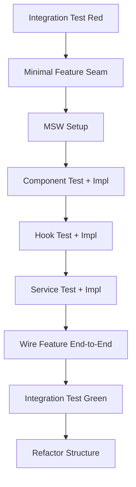

# Outside-In TDD (React Weather Kata)

This project uses strict Outside-In TDD with:

- React Testing Library for user behavior
- Vitest for test runner/assertions
- MSW for network-level API doubles

## Weather Feature Structure

```
src/features/weather/
  components/
    WeatherFeature.jsx
    WeatherSearch.jsx
    WeatherResult.jsx
  hooks/
    useWeather.js
  services/
    weatherService.js
  Weather.integration.test.jsx
  WeatherSearch.test.jsx
  useWeather.test.js
  weatherService.test.js
  index.js
```

## Naming Conventions

- Components use `PascalCase` filenames and exports.
- Hooks use `camelCase` with `use` prefix (`useWeather`).
- Services use `camelCase` (`weatherService`).
- Tests mirror their target and use `.test.js/.test.jsx`.

## Workflow Rules

1. Start from integration test (outer loop).
2. Move inward only when the current red test demands it.
3. Keep each change minimal and reversible.
4. Verify behavior through user-visible outcomes.

## Step-by-Step Flow Followed

1. Write `Weather.integration.test.jsx` from user behavior (search city -> see temperature).
2. Add minimal `WeatherFeature` seam so the test fails deeper.
3. Set up MSW server/handlers for deterministic API behavior.
4. Add `WeatherSearch.test.jsx` and implement `WeatherSearch`.
5. Wire `WeatherFeature` to render `WeatherSearch` with `onSearch`.
6. Add `useWeather.test.js` and implement `useWeather` state flow.
7. Add `weatherService.test.js` and implement `weatherService`.
8. Wire final `WeatherFeature` rendering (`loading`, `result`, `error`) and make integration green.
9. Refactor structure into `components/`, `hooks/`, and `services/`.


