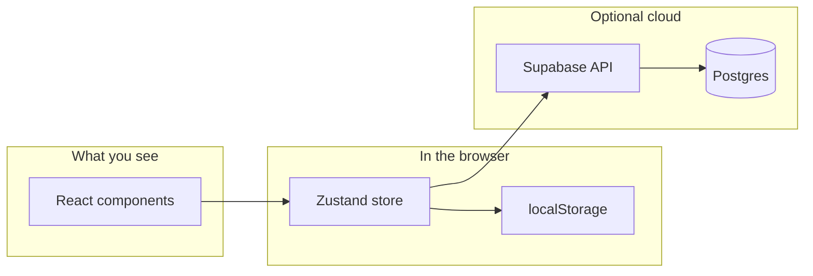
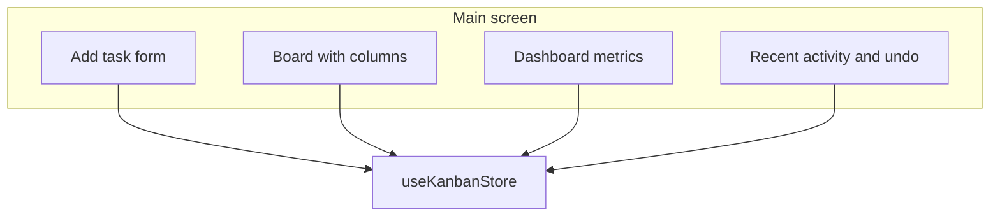
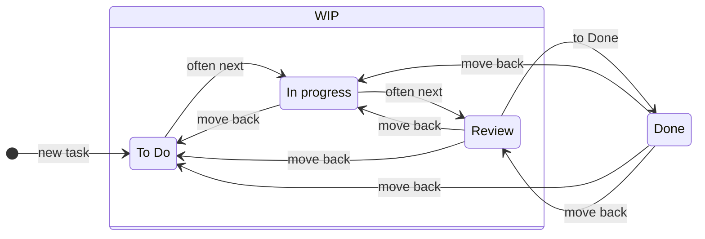
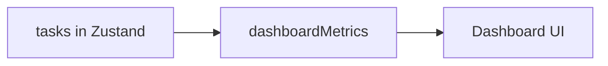
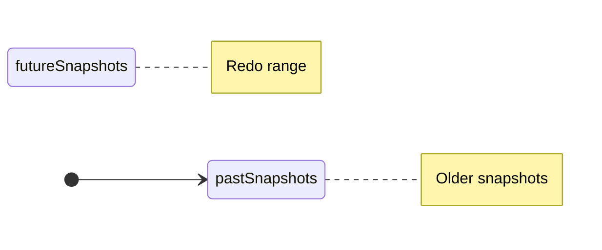
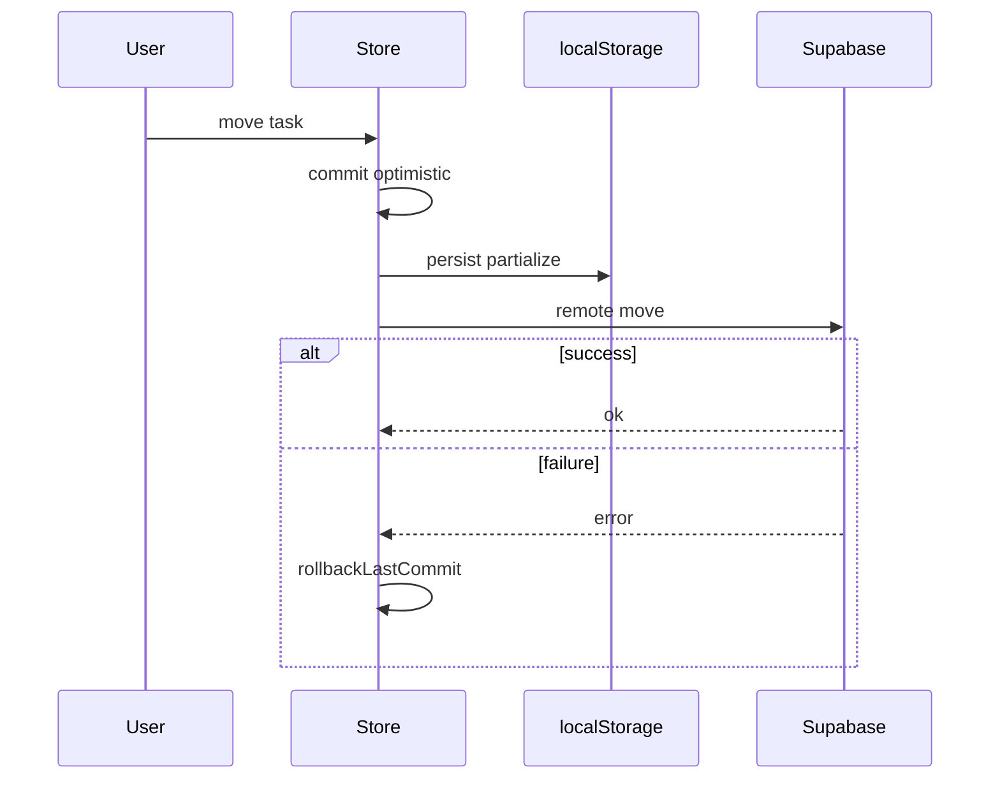
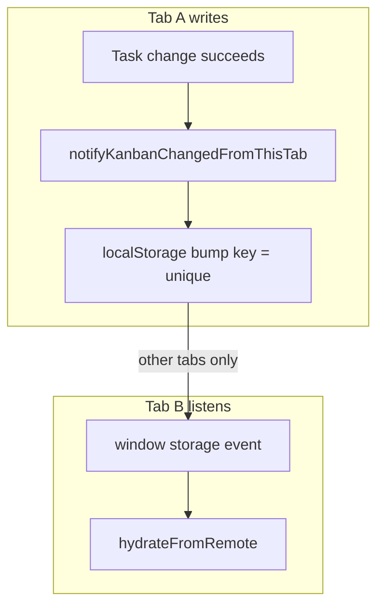

# Day 8 — Zustand Kanban Board

This folder is a **learning project**: a small **Kanban** (task board) web app you run in the browser. If you are new to the terms below, read the [Glossary](#glossary-for-beginners) first.

**What you will see:** columns like *To Do* and *Done*, cards you can drag, a form to add tasks, a small **analytics** area, **undo/redo**, and—if you configure a database—**cloud sync** so your board can be shared with a real backend.

**Stack in one sentence:** [React 19](https://react.dev/) draws the UI, [Zustand](https://github.com/pmndrs/zustand) holds the app’s data in memory, [Vite](https://vitejs.dev/) bundles and serves the app in development, and optionally [Supabase](https://supabase.com/) stores tasks in PostgreSQL.



---

## Glossary (for beginners)

| Term | Plain English |
|------|----------------|
| **Kanban** | A board with columns; each card is a task you move left-to-right as work progresses. |
| **React** | A library to build UIs from **components** (reusable pieces like a column or a button). |
| **State** | The current data the app knows about (task titles, which column each task is in, etc.). |
| **Zustand** | A tiny “state container” so many components can read and update the same data without prop-drilling. |
| **localStorage** | A place in the **browser** (not the server) where a site can save text that survives page reloads. |
| **Persist / rehydrate** | **Persist** = save state to `localStorage`. **Rehydrate** = on load, read that saved JSON back into the store. |
| **Supabase** | A hosted **Postgres** database plus auto-generated API; this project uses it to sync tasks to the server. |
| **Optimistic update** | Update the UI **first**, then call the network; if the network fails, **roll back** the UI to the previous snapshot. |
| **RLS (Row Level Security)** | Database rules that decide which rows a user can read or write. |

---

## Requirements

- **Node.js 20+** recommended  
- **npm** (or pnpm / yarn, if you know how to map commands)

---

## Quick start (first time)

```bash
cd "Day 8"
npm install
npm run dev
```

Open the URL Vite prints (usually `http://localhost:5173`).

**No database yet?** You do **not** have to set up Supabase to explore the app. If `VITE_SUPABASE_*` is unset (or empty in `.env`), the app uses **seed data** from [`src/store/initialData.ts`](src/store/initialData.ts) and saves the board to the browser with **localStorage** (key `day-8-kanban`, see [`src/lib/kanbanStorageKeys.ts`](src/lib/kanbanStorageKeys.ts)).

---

## npm scripts

| Command | What it does |
|--------|----------------|
| `npm run dev` | Start the dev server (hot reload). |
| `npm run build` | Typecheck + production bundle. |
| `npm run preview` | Serve the production build locally. |
| `npm test` | Run all tests once (Vitest). |
| `npm run test:watch` | Re-run tests when files change. |
| `npm run lint` | ESLint. |

---

## What’s in the app (feature tour)

The UI is made of a few main areas. The **store** (Zustand) is the single source of truth; components **subscribe** to slices of that state and **dispatch** actions (add task, move task, etc.).



### 1) Board: columns, cards, drag-and-drop

- **Columns** are fixed “lanes”: *To Do*, *In Progress*, *Review*, *Done* (see `ColumnId` in [`src/types/board.ts`](src/types/board.ts)).
- **Add a task** with [`AddTaskForm.tsx`](src/components/Board/AddTaskForm.tsx): title, description, and starting column. New task ids use `crypto.randomUUID()` so they are valid when stored as UUIDs in Postgres.
- **Edit / delete** from each card in [`TaskCard.tsx`](src/components/Board/TaskCard.tsx).
- **Move tasks** with **HTML5 drag-and-drop** in [`Board.tsx`](src/components/Board/Board.tsx) and [`Column.tsx`](src/components/Board/Column.tsx): you drag a card and drop it on another column; the store’s `moveTask` runs.

**Done column rule:** when a task lands in *Done*, the app sets a **completion timestamp** (`completedAt`). If you move it out of *Done*, that timestamp is cleared. Logic lives in [`src/store/slices/tasksSlice.ts`](src/store/slices/tasksSlice.ts) (`taskAfterColumnChange`).

**Typical task lifecycle (simplified):** you can drag a card to **any** column; the app does not enforce a path. The diagram below shows a **happy path** through the three “not done” columns (grouped as one **WIP** area), then **Done**; the dashed look inside `WIP` is only to make the “middle of the flow” easy to read.



*Here **WIP** (work in progress) is the **middle** of the story: the three “not done” columns from [`ColumnId`](src/types/board.ts). It is a drawing aid only, not a separate field in the store. The real app can drag a card to any column in one step, not only along these arrows.*

---

### 2) Dashboard: analytics and “how healthy is the board?”

[`Dashboard.tsx`](src/components/Dashboard/Dashboard.tsx) reads your **current tasks** and shows numbers computed in [`src/lib/analytics/dashboardMetrics.ts`](src/lib/analytics/dashboardMetrics.ts).

| Idea | What it means here |
|------|----------------------|
| **Completion rate** | Share of tasks that are in *Done* (or otherwise “completed” by the metrics logic). |
| **Overdue** | Tasks with a **due date** in the past (if you set due dates). |
| **Average lead time** | For completed tasks, average time from **created** to **completed** (where timestamps exist). |
| **Trend** | Compares **median** lead time in one time window vs the **previous** window (7-day bands by default). The UI might show *improving*, *declining*, *stable*, or a placeholder when there isn’t enough data. |

**Beginner note:** the dashboard is **derived data**: it does not store its own copy; when tasks change, React re-renders and numbers update.


---

### 3) Recent activity, undo, and redo

[`RecentActivity.tsx`](src/components/Board/RecentActivity.tsx) shows an **activity log** (newest first): add, update, move, remove—each with a short summary.

**Undo / redo** are **snapshot-based**:

1. On each change that should be undoable, the store saves a **snapshot** of the board slice (title, column ids, tasks) in a **past** stack.  
2. **Undo** restores the **previous** snapshot and pushes the “current” state onto a **future** stack.  
3. **Redo** does the reverse.  
4. A **new** user action (a new “commit”) **clears** the redo stack (standard behavior in editors).



Code paths: `commit()` in [`src/store/index.ts`](src/store/index.ts), `undo` / `redo` in the same file, and [`cloneUndoable`](src/store/history/cloneUndoable.ts) / [`rollbackLastCommit`](src/store/history/rollbackLastCommit.ts) for failed remote work.

---

### 4) Sync error banner (when the server disagrees)

If a **Supabase** write fails—or **undo/redo** cannot **reconcile** the database—`syncError` is set in the store. [`Board.tsx`](src/components/Board/Board.tsx) shows a banner and you can **dismiss** with `clearSyncError`. The board may still show optimistic state until you fix the issue or refresh from the server (depending on the failure).

---

### 5) Optional authentication (with Supabase)

When Supabase env vars are present, the app can require sign-in. [`AuthProvider.tsx`](src/context/AuthProvider.tsx) loads a session, surfaces **sign in / sign up** screens from [`App.tsx`](src/App.tsx), and exposes **role** and **display name** for the board header. Session lives in the Supabase client (browser storage that Supabase controls).

---

### 6) State management: Zustand, middleware, and “where does truth live?”

[`src/store/index.ts`](src/store/index.ts) creates `useKanbanStore`.

| Concept | In this project |
|--------|------------------|
| **Single store** | Board title, `columnIds`, `tasks`, history stacks, `activityLog`, `syncError`, and actions. |
| **commit()** | Wraps many mutations: save undo snapshot, append activity, apply patch. |
| **Middleware: `persist`** | Saves a **subset** of state to `localStorage` and reloads it on app start. |
| **Middleware: `devtools`** | Connects to Redux DevTools in **development** only. |
| **Remote actions** | If Supabase is configured, task actions call the server **after** the optimistic `commit` (see [`createTasksActionsWithRemote`](src/store/slices/tasksSlice.ts)); on error, `rollbackLastCommit` restores the last good snapshot. |
| **Selectors** | `Board` uses `useShallow` from `zustand/react/shallow` to avoid re-renders when unrelated fields change. |

**Persistence “rules” (important for cross-tab, below):**

| Mode | What gets saved in `localStorage` |
|------|-----------------------------------|
| **Supabase off** | `boardTitle`, `columnIds`, `tasks` (full local board). |
| **Supabase on** | Mainly `columnIds` (see `partialize` in [`src/store/index.ts`](src/store/index.ts)); `boardTitle` and `tasks` are expected to be loaded from the server with `hydrateFromRemote()`. |

So: **with the server**, task moves do **not** always produce a new JSON blob in the main persist key—**another tab** cannot rely on that key alone to know “the server just changed”.

**resetBoard:** offline → reset to fresh seed. With Supabase → clear local history/activity and call `hydrateFromRemote()` (no mass server delete in this training app).



---

### 7) Cross-tab synchronization (two windows, one board)

**Problem:** you open **two** browser tabs to the same app. When **Tab A** changes the board, **Tab B** should catch up. For **fully local** mode, Zustand’s `persist` updates `localStorage`, and the browser fires a `storage` event in **other** tabs (not in the same tab) so we can `rehydrate()`. With **Supabase**, the persisted key often **does not** include all task fields, so a task move may **not** change that JSON—other tabs need another signal.

**Solution in this repo** ([`src/lib/crossTabSync/crossTabSync.ts`](src/lib/crossTabSync/crossTabSync.ts), wired from [`App.tsx`](src/App.tsx) with `connectKanbanCrossTabSync`):

1. **Persist key** (`day-8-kanban`): on `storage`, call `persist.rehydrate()`.  
2. **“Bump” key** (`day-8-kanban-remote-bump`): after a **successful** remote change, the writer tab sets a **new unique string** (timestamp + random id) in `localStorage`. Other tabs receive a `storage` event and run `hydrateFromRemote()` to pull the latest from Postgres.  
3. The bump must be **unique every time**; if two writes stored the same string, some browsers would **not** fire a second `storage` event, so sync could look like it “worked only once.”  
4. If the other tab is still restoring auth, the handler may wait for a **session** (with a safe timeout) before refetching.



`notify` is called from the store after successful remote work (see `onRemoteSuccess` in [`tasksSlice.ts`](src/store/slices/tasksSlice.ts)) and after certain history reconciles (undo/redo with server) in [`src/store/index.ts`](src/store/index.ts).

**Beginner test:** two windows, same origin, same login if required—move a card in A; B should update within a short moment. If you see a **sync** error banner, check network and RLS, not just cross-tab code.

---

## Supabase backend (optional)

### 1) Create a project

[supabase.com](https://supabase.com) — keep the project **URL** and **anon** key from **Settings → API**.

### 2) Run the SQL migration

In the Supabase **SQL** editor, run the full file [`supabase/migrations/001_initial.sql`](supabase/migrations/001_initial.sql).

It creates `public.boards` and `public.tasks`, seed data for board id `10000000-0000-4000-8000-000000000001`, enables **RLS**, and includes **demo-only** policies. Replace them before any real production use.

### 3) Environment variables

Copy [`.env.example`](.env.example) to **`.env`** or **`.env.local`** in this folder. Only names starting with `VITE_` are visible to the **browser** (never put the service-role key here).

| Variable | Purpose |
|----------|--------|
| `VITE_SUPABASE_URL` | Project URL, no trailing slash |
| `VITE_SUPABASE_ANON_KEY` | **anon** public key |
| `VITE_DEFAULT_BOARD_ID` | Must match the seeded board UUID in the migration |

Restart `npm run dev` after changes. [`vite.config.ts`](vite.config.ts) sets `root` and `envDir` so `.env` resolves from this directory.

### 4) What happens at runtime

- [`App.tsx`](src/App.tsx) calls `hydrateFromRemote()` when the client, default board id, and (if required) **session** are ready.  
- **Mapping** between app `Task` and database rows: [`taskRow.ts`](src/lib/supabase/taskRow.ts); types: [`database.types.ts`](src/lib/supabase/database.types.ts).  
- **Undo/redo** with a remote board: [`reconcileRemoteTasks`](src/lib/supabase/boardRemote.ts) replays a planned set of changes so Postgres matches the new task list. Failure rolls back the local step and sets `syncError`.  

**Runtime behaviour (same diagram as “optional cloud” above):** optimistic commit → network → rollback on failure.

### 5) Troubleshooting

| Symptom | What to check |
|--------|----------------|
| `PGRST205` / 404 on `boards` | Migration not run on **this** project, or `VITE_SUPABASE_URL` points to the wrong project. |
| App ignores `.env` | Start dev from the **Day 8** folder: `cd "Day 8" && npm run dev`. |
| Tests go online | Vitest config clears `VITE_SUPABASE_*` in tests ([`vite.config.ts`](vite.config.ts) `test.env`). |

Shorter pointer file: [`README-SUPABASE.md`](README-SUPABASE.md).

---

## Repository layout (high level)

```
Day 8/
├── .env.example
├── index.html
├── package.json
├── README.md
├── README-SUPABASE.md
├── supabase/migrations/001_initial.sql
├── vite.config.ts
└── src/
    ├── App.tsx, main.tsx
    ├── context/            # auth
    ├── components/         # Board, Dashboard, Auth pages
    ├── store/              # Zustand store, slices, history
    ├── lib/
    │   ├── analytics/
    │   ├── crossTabSync/  # cross-tab listeners + notify
    │   ├── kanbanStorageKeys.ts
    │   └── supabase/
    └── types/
```

A fuller tree (files and test modules) is easy to list with your editor or `find`; the important idea is: **`store/` = brain**, **`components/` = view**, **`lib/supabase/` = API boundary**.

---

## Testing

| File | What it covers |
|------|----------------|
| [`App.test.tsx`](src/App.test.tsx) | Board, dashboard, drag, persist rehydration |
| [`store/index.test.ts`](src/store/index.test.ts) | Store actions, reset, cross-tab `storage` wiring |
| [`store/actionHistory.test.ts`](src/store/actionHistory.test.ts) | History and undo/redo |
| [`store/history/rollbackLastCommit.test.ts`](src/store/history/rollbackLastCommit.test.ts) | Failed remote rollback |
| [`lib/analytics/dashboardMetrics.test.ts`](src/lib/analytics/dashboardMetrics.test.ts) | Metrics and trend |
| [`lib/supabase/planTaskReconciliation.test.ts`](src/lib/supabase/planTaskReconciliation.test.ts) | Remote diff for undo |

Tests use **Vitest**, **Testing Library**, and **jsdom**.

---

## Git and secrets

[`.gitignore`](.gitignore) ignores real env files. Do not commit **anon** keys you care about in public repos; rotate if leaked.

## License / use

Training / private use — adjust for your organization.
